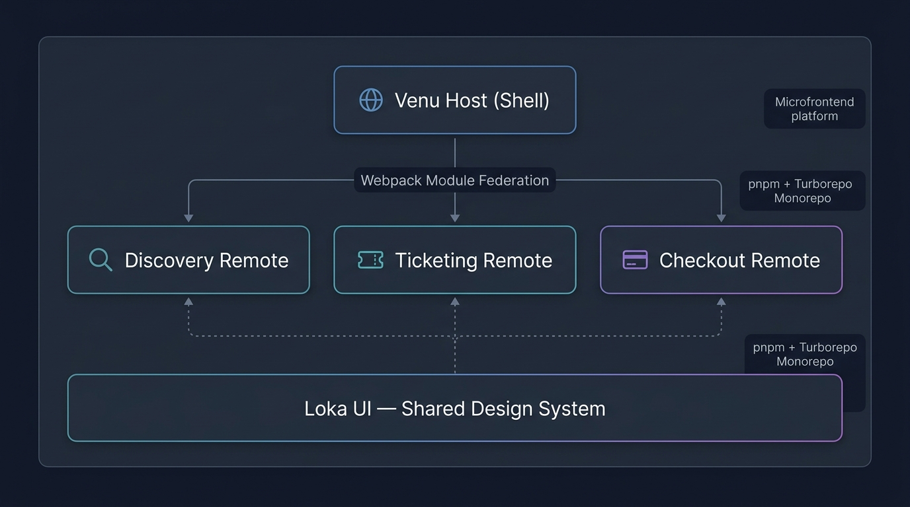

<div align="center">
  <h1>Venu Ecosystem</h1>
  <p><strong>A Modern, High-Demand Event Ticketing Platform built with Microfrontends</strong></p>
  
  <p>
    <a href="https://reactjs.org/"></a>
    <a href="https://www.typescriptlang.org/"></a>
    <a href="https://webpack.js.org/"></a>
    <a href="https://tailwindcss.com/"></a>
    <a href="https://supabase.com/"></a>
    <a href="https://turbo.build/"></a>
  </p>
</div>

---

## 🎬 Demo

<div align="center">
  
</div>

---

## 🎯 The Problem & Our Solution

Purchasing tickets for high-demand events (like major tech conferences or creative festivals) is often a frustrating experience. Customers face issues with queueing, limited inventory, and temporary seat reservations, while platforms struggle with complex client/server state management under immense load.

**Venu** is built to solve these UX challenges. It provides a highly responsive, robust, and visually engaging ticket purchasing journey. By utilizing a **Microfrontend (MFE)** architecture, Venu separates the complex domains of event discovery, ticketing queues, and checkout into independently deployable applications without sacrificing the unified user experience.

---

## 🏗 Architecture Overview

Venu operates as a monorepo (managed by Turborepo and pnpm workspaces) that stitches together several independently developed applications using **Webpack 5 Module Federation**.

<div align="center">
  
</div>

### Domain Responsibilities

- **Host:** The global shell, navigation, and route composer. It owns the error boundaries and global layout.
- **Discovery:** Handles the "top-of-funnel" experience—event exploration, search, and galleries.
- **Ticketing:** The core engine for inventory management, high-demand wait rooms, and seat selection.
- **Checkout:** Processes attendee details, payment simulations, and digital ticket generation.
- **Loka UI:** A bespoke design system focused on minimal structure, expressive motion, and highly responsive generic components.

---

## ✨ Key Features & User Journey

1. **Multi-Event Discovery:** Browse, search, and explore featured tech and creative events with rich multimedia layouts.
2. **High-Demand Queue Simulation:** Fair waiting room mechanics and queue state transitions during peak ticket releases.
3. **Interactive Seat Selection:** Real-time seat mapping with temporary inventory reservation logic.
4. **Guest-First Checkout:** Streamlined purchasing flow with payment simulation, eliminating the need for upfront account creation.
5. **Digital Tickets:** Instant booking confirmation and verifiable digital ticket generation.

---

## 🚀 Getting Started

### Prerequisites

- [Node.js](https://nodejs.org/) (v18+)
- [pnpm](https://pnpm.io/) (v8+)

### Installation

1. Clone the repository:
   ```bash
   git clone <your-repo-url>
   cd venu
   ```

2. Install dependencies:
   ```bash
   pnpm install
   ```

3. Set up environment variables:
   ```bash
   cp .env.example .env
   # Update .env with necessary keys (e.g., Supabase credentials)
   ```

### Development

To start all microfrontends concurrently in development mode:

```bash
pnpm dev
```

This command uses Turborepo to spin up the Host, Discovery, Ticketing, and Checkout applications simultaneously on different local ports, resolving module federation locally.

### Build

To build all applications for production deployment:

```bash
pnpm build
```

---

## 📄 License

This project is licensed under the [MIT License](LICENSE).
